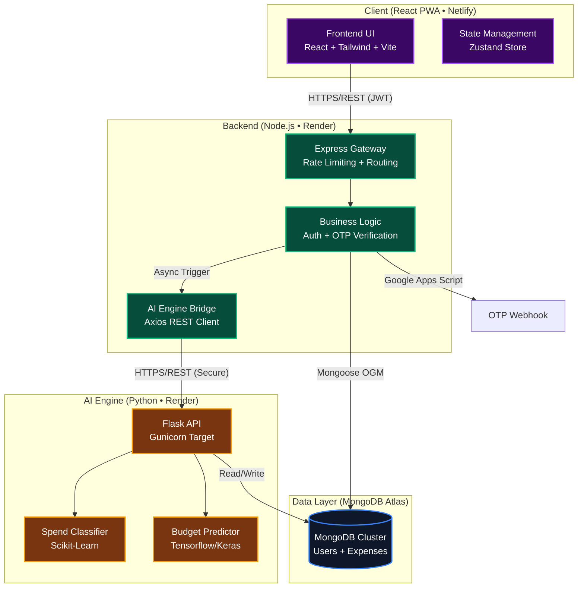

# Sc₹awnySpend - Smart Expense Tracker

Sc₹awnySpend is an AI-powered, full-stack personal finance application. It allows users to track their expenses, visualize financial habits, and receive machine-learning-driven budget predictions and anomaly detection. 

The entire project is built on a modern, 100% free cloud-native architecture deployed across Netlify, Render, and MongoDB Atlas.

## System Architecture

## Data Lifecycle & AI Integration Workflow

```mermaid
sequenceDiagram
    autonumber
    actor User as User (PWA)
    participant React as Netlify (Frontend)
    participant Node as Render (Node.js API)
    participant Mongo as Atlas (MongoDB M0)
    participant Python as Render (Python AI)

    User->>React: Submits new Expense
    React->>Node: POST /api/expenses (with JWT)
    Node->>Mongo: Validate & Save Expense to DB
    Mongo-->>Node: 201 Created (Expense ID)
    
    %% Async AI Trigger
    rect rgb(20, 30, 40)
    Note right of Node: Non-blocking AI Trigger
    Node-)Python: POST /api/ai/classify (Internal Request)
    Python->>Mongo: Retrieve Last 30 Days Context
    Python->>Python: Run Isolation Forest (Anomaly)<br/>Run ANN (Prediction)
    Python->>Mongo: Save Insights & Flags
    end
    
    Node-->>React: Response 201 OK
    React-->>User: Updates UI Dashboard
    
    %% Subsequent Read
    User->>React: Clicks "AI Insights" Tab
    React->>Node: GET /api/ai/insights
    Node->>Mongo: Fetch Stored Python Predictions
    Node-->>React: Returns JSON
    React-->>User: Renders Custom AI Dashboard
```

